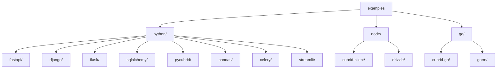

# Contributing to cubrid-cookbook

Thank you for your interest in contributing! This document provides guidelines
and instructions for contributing to the project.

## Table of Contents

- [Adding Examples](#adding-examples)
- [Code Style](#code-style)
- [Pull Request Guidelines](#pull-request-guidelines)
- [Reporting Issues](#reporting-issues)

---

## Adding Examples

### Guidelines

1. **Every example must work** — verify against a live CUBRID instance before submitting
2. **Prefix all table names** with `cookbook_` to avoid conflicts
3. **Include a README** for each example with setup and run instructions
4. **Follow the existing directory structure**:



### Running Examples

```bash
# Start CUBRID
docker compose up -d

# Python examples
cd python/fastapi
pip install -r requirements.txt
python app/main.py

# Node.js examples
cd node/drizzle
npm install
npx tsx src/index.ts

# Go examples
cd go/gorm
go run main.go
```

---

## Code Style

### Python

This project uses [Ruff](https://docs.astral.sh/ruff/) for linting and formatting.

- **Line length**: 100 characters
- **Target Python**: 3.10+
- **Formatter**: `ruff format`
- **Linter**: `ruff check`

```bash
# Check lint
ruff check python/

# Auto-fix lint issues
ruff check --fix python/

# Check formatting
ruff format --check python/

# Apply formatting
ruff format python/
```

### TypeScript

- Use modern TypeScript (ES modules, `import`/`export`)
- Follow the existing pattern in `node/` examples

### Go

- Use standard `go fmt` formatting
- Follow Go conventions (`gofmt`, `go vet`)

---

## Pull Request Guidelines

### Before Submitting

1. **Create a feature branch** from `main`:
   ```bash
   git checkout -b feature/my-example main
   ```

2. **Verify your example works** against a live CUBRID instance:
   ```bash
   docker compose up -d
   # Run your example and confirm it works
   ```

3. **Run lint checks** on Python code:
   ```bash
   ruff check python/
   ruff format --check python/
   ```

### PR Content

- Keep PRs focused — one example or fix per PR.
- Write a clear title and description explaining _what_ and _why_.
- Reference any related issues (e.g., `Fixes #42`).
- Include output demonstrating the example works.

### Review Process

- All PRs require at least one review before merge.
- CI must pass (lint checks).
- Examples must be tested against a live CUBRID instance.

---

## Reporting Issues

When reporting a bug in an example, please include:

- Which example you're running
- Python/Node.js/Go version
- CUBRID server version
- Full error output
- Steps to reproduce

For new example requests, describe the use case and framework.

---

## Questions?

Open a [GitHub Discussion](https://github.com/cubrid-labs/cubrid-cookbook/discussions)
or file an [issue](https://github.com/cubrid-labs/cubrid-cookbook/issues).
