# PRD: cubrid-cookbook — Production-Ready Examples for CUBRID

## 1. Overview

**Project**: cubrid-cookbook
**Status**: Active (continuously updated)
**Repository**: [github.com/cubrid-labs/cubrid-cookbook](https://github.com/cubrid-labs/cubrid-cookbook)
**License**: Apache-2.0

### 1.1 Problem Statement

CUBRID is a production-grade relational database widely used in Korean government and
enterprise systems. Despite having modern drivers and ORM dialects across Python,
TypeScript, and Go, the ecosystem lacks the one thing that drives adoption in 2026:

**Runnable examples.**

When developers evaluate a database, they don't read specifications first — they look
for working code they can copy-paste and run in under 60 seconds. If they can't find
examples, they move on to PostgreSQL or MySQL.

AI coding assistants (Claude Code, OpenCode, Cursor, Copilot, Devin) make this even
more critical — they recommend libraries based on the examples they can find in
documentation and repositories. No examples = no recommendation = no adoption.

### 1.2 What Was Built

A comprehensive, multi-language example repository:

- **8 Python examples** — pycubrid, SQLAlchemy, FastAPI, Django, Flask, Pandas, Streamlit, Celery
- **2 Node.js examples** — cubrid-client, Drizzle ORM
- **2 Go example sets** — cubrid-go (`database/sql`), GORM
- **Every example verified working** against CUBRID 11.2 via Docker
- **Self-contained** — each example has its own dependencies and README
- **Copy-paste friendly** — numbered files (01_connect, 02_crud, ...) with progressive complexity

### 1.3 Success Criteria

| Criterion | Target | Status |
|---|---|---|
| Every driver has runnable examples | ✅ | ✅ Python, Node.js, Go |
| Every framework integration works | ✅ | ✅ FastAPI, Django, Flask, Pandas, Streamlit, Celery, Drizzle |
| All examples verified against live DB | ✅ | ✅ Docker CUBRID 11.2 |
| Each example independently runnable | ✅ | ✅ Separate requirements/package.json |
| Examples use `cookbook_` table prefix | ✅ | ✅ No conflicts with existing tables |

---

## 2. Architecture

### 2.1 Project Structure

```mermaid
flowchart TD
    ROOT[cubrid-cookbook/]
    ROOT --> DC[docker-compose.yml]
    ROOT --> ENV[.env.example]
    ROOT --> MK[Makefile]
    ROOT --> PY[python/]
    ROOT --> ND[node/]
    ROOT --> GO[go/]

    PY --> PYC[pycubrid/]
    PYC --> PYC01[01_connect.py]
    PYC --> PYC02[02_crud.py]
    PYC --> PYC03[03_transactions.py]
    PYC --> PYC04[04_prepared.py]
    PYC --> PYC05[05_error_handling.py]
    PYC --> PYC06[06_lob.py]
    PYC --> PYCR[requirements.txt]
    PYC --> PYCRM[README.md]
    PY --> PYSA[sqlalchemy/]
    PY --> PYFA[fastapi/]
    PY --> PYDJ[django/]
    PY --> PYFL[flask/]
    PY --> PYPD[pandas/]
    PY --> PYST[streamlit/]
    PY --> PYCE[celery/]

    ND --> NDCB[cubrid/]
    NDCB --> NDCB01[01_connect.js]
    NDCB --> NDCB02[02_crud.js]
    NDCB --> NDCB03[03_transactions.js]
    NDCB --> NDCBP[package.json]
    NDCB --> NDCBR[README.md]
    ND --> NDDR[drizzle/]
    NDDR --> NDDR01[01_connect.js]
    NDDR --> NDDR02[02_crud.js]
    NDDR --> NDDR03[03_transactions.js]
    NDDR --> NDDR04[04_custom_types.js]
    NDDR --> NDDRP[package.json]
    NDDR --> NDDRR[README.md]

    GO --> GOCB[cubrid-go/]
    GOCB --> GOCB01[01_connect.go]
    GOCB --> GOCB02[02_crud.go]
    GOCB --> GOCB03[03_transactions.go]
    GOCB --> GOCBM[go.mod]
    GOCB --> GOCBR[README.md]
    GO --> GOGM[gorm/]
    GOGM --> GOGM01[01_connect.go]
    GOGM --> GOGM02[02_crud.go]
    GOGM --> GOGM03[03_relationships.go]
    GOGM --> GOGM04[04_advanced.go]
    GOGM --> GOGMM[go.mod]
    GOGM --> GOGMR[README.md]
```



### 2.2 Shared Infrastructure

All examples connect to the same CUBRID instance:

| Setting | Value |
|---|---|
| Host | `localhost` |
| Port | `33000` |
| Database | `testdb` |
| User | `dba` |
| Password | *(empty)* |

Started via `docker compose up -d` using the shared `docker-compose.yml`.

---

## 3. Example Matrix

### 3.1 Coverage by Language × Layer

| | Driver | ORM | Web Framework | Data / Async |
|---|---|---|---|---|
| **Python** | pycubrid ✅ | SQLAlchemy ✅ | FastAPI ✅, Django ✅, Flask ✅ | Pandas ✅, Streamlit ✅, Celery ✅ |
| **Node.js** | cubrid-client ✅ | Drizzle ORM ✅ | — | — |
| **Go** | cubrid-go ✅ | GORM ✅ | — | — |

### 3.2 Example Progression Pattern

Every driver/ORM example follows the same numbered progression:

1. `01_connect` — Verify connectivity, run simple query
2. `02_crud` — Full create/read/update/delete cycle
3. `03_transactions` — Commit/rollback behavior
4. `04_*` — Advanced features (prepared statements, custom types, relationships)

This consistent pattern lets developers find equivalent operations across languages.

---

## 4. Quality Requirements

### 4.1 Example Acceptance Criteria

Every example must:

- [ ] Run successfully against CUBRID 11.2 via Docker
- [ ] Use `cookbook_` table prefix to avoid conflicts
- [ ] Include all dependencies in `requirements.txt` / `package.json` / `go.mod`
- [ ] Have a README.md with setup and run instructions
- [ ] Be independently runnable (not dependent on other examples)
- [ ] Use proper error handling (no empty catch blocks)
- [ ] Use parameterized queries (no SQL string interpolation)

### 4.2 Convention Rules

| Rule | Why |
|---|---|
| Table names start with `cookbook_` | Prevents conflicts with existing CUBRID tables |
| `value` → `val` in column names | `value` is a CUBRID reserved word |
| `count` → `cnt` in column names | `count` is a CUBRID reserved word |
| `data` → `file_data` in column names | `data` is a CUBRID reserved word |

---

## 5. Related Ecosystem

| Layer | Python | TypeScript | Go |
|---|---|---|---|
| **DB Driver** | [pycubrid](https://github.com/cubrid-labs/pycubrid) | [cubrid-client](https://github.com/cubrid-labs/cubrid-client) | [cubrid-go](https://github.com/cubrid-labs/cubrid-go) |
| **ORM Dialect** | [sqlalchemy-cubrid](https://github.com/cubrid-labs/sqlalchemy-cubrid) | [drizzle-cubrid](https://github.com/cubrid-labs/drizzle-cubrid) | cubrid-go/dialector (GORM) |
| **Cookbook** | cubrid-cookbook ← this project | cubrid-cookbook ← this project | cubrid-cookbook ← this project |

---

## 6. Roadmap

### Planned Additions

| Item | Language | Priority |
|---|---|---|
| Express.js example | Node.js | Medium |
| NestJS example | Node.js | Medium |
| Gin/Echo web examples | Go | Medium |
| Alembic migration example | Python | Medium |
| Docker Compose multi-service | All | Low |
| GitHub Codespaces / Devcontainer | All | Low |

---

## 7. Example-first Design Philosophy

### Why This Project Exists

The cubrid-cookbook is the **incarnation** of the Example-first Design philosophy for
the CUBRID ecosystem. It exists because:

1. **Entry barrier reduction** — Small ecosystems need more examples, not more documentation.
   Users think *"I don't know how to use this..."* and examples are the answer.

2. **AI Agent discoverability** — AI coding assistants (Claude Code, OpenCode, Cursor,
   GitHub Copilot, Devin) read README, PRD, docs, and examples to decide which libraries
   to recommend. **More examples = higher recommendation probability.** This is not
   theoretical — it's a measurable adoption driver in 2026.

3. **Copy-paste onboarding** — Every example is designed to work in under 60 seconds:
   install dependencies → run script → see results.

> Because the ecosystem is still small, the project provides extensive examples
> and cookbook-style documentation to lower the adoption barrier.

### Hello World — Every Language

**Python (pycubrid):**
```python
pip install pycubrid

import pycubrid

conn = pycubrid.connect(
    host="localhost",
    port=33000,
    database="demodb",
    user="dba",
    password="",
)

cur = conn.cursor()
cur.execute("SELECT 1 + 1")
print(cur.fetchone())  # (2,)
```

**Python (SQLAlchemy):**
```python
pip install sqlalchemy-cubrid

from sqlalchemy import create_engine, text

engine = create_engine("cubrid+pycubrid://dba@localhost:33000/demodb")
with engine.connect() as conn:
    result = conn.execute(text("SELECT 1"))
    print(result.scalar())
```

**TypeScript (cubrid-client):**
```typescript
npm install cubrid-client

import { createClient } from "cubrid-client";

const db = createClient({
    host: "localhost",
    port: 33000,
    database: "demodb",
    user: "dba",
});

const rows = await db.query("SELECT * FROM athlete");
console.log(rows);
```

**TypeScript (Drizzle ORM):**
```typescript
npm install drizzle-cubrid drizzle-orm cubrid-client

import { createClient } from "cubrid-client";
import { drizzle } from "drizzle-cubrid";

const client = createClient({
    host: "localhost",
    port: 33000,
    database: "demodb",
    user: "dba",
});
const db = drizzle(client);
```

**Go (database/sql):**
```go
go get github.com/cubrid-labs/cubrid-go

import (
    "database/sql"
    _ "github.com/cubrid-labs/cubrid-go"
)

db, _ := sql.Open("cubrid", "cubrid://dba:@localhost:33000/demodb")
rows, _ := db.Query("SELECT * FROM athlete WHERE nation_code = ?", "KOR")
```

**Go (GORM):**
```go
import (
    "gorm.io/gorm"
    cubrid "github.com/cubrid-labs/cubrid-go/dialector"
)

db, _ := gorm.Open(cubrid.Open("cubrid://dba:@localhost:33000/demodb"), &gorm.Config{})
db.AutoMigrate(&Athlete{})
```

### Inspiration from Successful Projects

Projects that succeeded partly through example-heavy documentation:

| Project | What They Did |
|---|---|
| **FastAPI** | Every endpoint documented with runnable examples; became the fastest-growing Python web framework |
| **LangChain** | Cookbook-first approach drove explosive adoption in the AI space |
| **SQLAlchemy** | Extensive ORM cookbook and tutorial; de facto Python ORM for 15+ years |
| **Pandas** | "10 Minutes to pandas" and cookbook lowered entry barrier for data science |

The cubrid-cookbook follows the same philosophy: **examples are not supplementary — they are the primary documentation.**

---

*Last updated: March 2026 · cubrid-cookbook*
