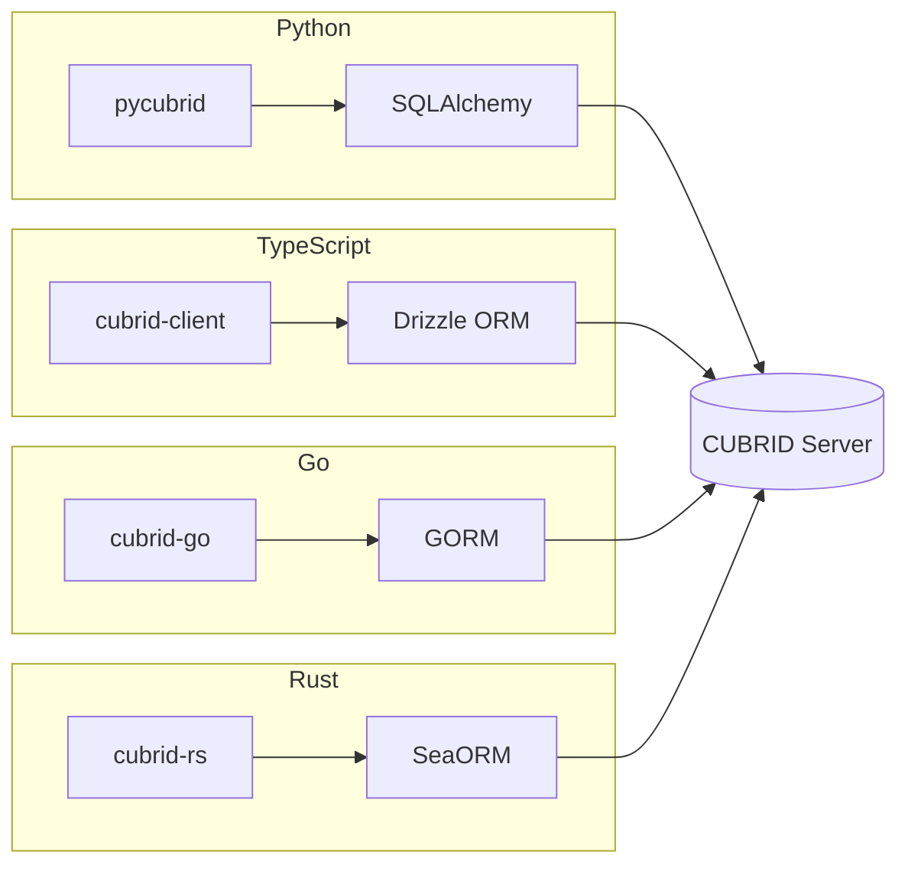

# CUBRID Cookbook 🍳

**Production-ready examples for using CUBRID with Python, TypeScript, Node.js, Go, and Rust** — SQLAlchemy, FastAPI, Django, Flask, Drizzle ORM, GORM, SeaORM, and more.

<!-- BADGES:START -->
[](LICENSE)
[](https://www.cubrid.org/)
[](https://www.python.org/downloads/)
[](https://nodejs.org/)
[](https://go.dev)
[](https://www.rust-lang.org/)
[](https://github.com/cubrid-labs/cubrid-cookbook)
<!-- BADGES:END -->

---

> **New here?** Start with the [CUBRID in 5 Minutes](GETTING_STARTED.md) guide — pick your language and build something in one page.


## What is this?

Copy-paste friendly, **runnable** examples showing how to use [CUBRID](https://www.cubrid.org/) with popular frameworks and drivers across multiple languages. Every example connects to a real CUBRID database via Docker.

## Ecosystem Overview



## Examples

### 🐍 Python

| Example | Framework | Description |
|---------|-----------|-------------|
| [pycubrid](python/pycubrid/) | pycubrid | Direct DB-API 2.0 driver — connect, query, transactions, prepared statements, LOBs |
| [sqlalchemy](python/sqlalchemy/) | SQLAlchemy | Core + ORM — engine, models, CRUD, DML extensions (ODKU, MERGE, REPLACE) |
| [fastapi](python/fastapi/) | FastAPI | REST API with automatic docs, dependency injection, async-ready |
| [django](python/django/) | Django | Django project with CUBRID via SQLAlchemy bridge |
| [flask](python/flask/) | Flask | Flask + Flask-SQLAlchemy — blueprints, models, CRUD routes |
| [pandas](python/pandas/) | Pandas | Data analysis pipeline — read_sql, transforms, visualization |
| [streamlit](python/streamlit/) | Streamlit | Interactive data dashboard with live CUBRID queries |
| [celery](python/celery/) | Celery | Async task queue — background jobs backed by CUBRID |

### 🟩 Node.js

| Example | Driver | Description |
|---------|--------|-------------|
| [cubrid](node/cubrid/) | cubrid-client | Modern Promise-based client — connect, query, CRUD, transactions |
| [drizzle](node/drizzle/) | Drizzle ORM | Type-safe ORM — schema, query builder, CRUD, transactions, custom types |

### 🟦 TypeScript

| Example | Driver | Description |
|---------|--------|-------------|
| [typescript](typescript/) | cubrid-client | TypeScript scripts + focused error handling patterns |

### 🐹 Go

| Example | Driver | Description |
|---------|--------|-------------|
| [cubrid-go](go/cubrid-go/) | cubrid-go | Pure Go `database/sql` driver — connect, query, CRUD, transactions |
| [gorm](go/gorm/) | GORM | GORM ORM — AutoMigrate, models, CRUD, relationships, advanced queries |

### 🦀 Rust

| Example | Driver | Description |
|---------|--------|-------------|
| [cubrid-rs](rust/cubrid-rs/) | cubrid-tokio | Native Rust async driver — connect, query, CRUD, transactions |
| [sea-orm-cubrid](rust/sea-orm-cubrid/) | SeaORM + sea-orm-cubrid | SeaORM backend for CUBRID — connect, entity CRUD |

## Quick Start

### 1. Start CUBRID

```bash
docker compose up -d
# Wait for CUBRID to be ready
make up
```

### 2. Pick an example

**Python:**
```bash
cd python/fastapi
pip install -r requirements.txt
uvicorn app.main:app --reload
```

**Node.js:**
```bash
cd node/cubrid
npm install
node 01_connect.js
```

**TypeScript:**
```bash
cd typescript
npm install
npm run connect
```

**Go:**
```bash
cd go/cubrid-go
go run 01_connect.go
```

**Rust:**
```bash
cd rust/cubrid-rs
cargo run --bin 01_connect
```

Every example has its own `README.md` with setup instructions.

### 3. Clean up

```bash
make clean
```

## Prerequisites

- **Docker** and **Docker Compose** (for the CUBRID database)
- **Python 3.10+** (for Python examples)
- **Node.js 18+** (for Node.js examples)
- **TypeScript 5+** (for TypeScript examples)
- **Go 1.21+** (for Go examples)
- **Rust 1.70+** (for Rust examples)
- Each example lists its own dependencies in `requirements.txt`, `package.json`, `go.mod`, or `Cargo.toml`

## Project Structure

```mermaid
flowchart TD
    ROOT[cubrid-cookbook/]
    ROOT --> DC[docker-compose.yml]
    ROOT --> ENV[.env.example]
    ROOT --> MK[Makefile]
    ROOT --> PY[python/]
    ROOT --> TS[typescript/]
    ROOT --> ND[node/]
    ROOT --> GO[go/]
    ROOT --> RS[rust/]

    PY --> PYC[pycubrid/]
    PY --> PYSA[sqlalchemy/]
    PY --> PYFA[fastapi/]
    PY --> PYDJ[django/]
    PY --> PYFL[flask/]
    PY --> PYPD[pandas/]
    PY --> PYST[streamlit/]
    PY --> PYCE[celery/]
    PY --> PYER[error-handling/]

    TS --> TS01[01_connect.ts]
    TS --> TSDC[docker-compose.yml]
    TS --> TSDO[Dockerfile]
    TS --> TSER[error-handling/]

    ND --> NDCB[cubrid/]
    ND --> NDDR[drizzle/]

    GO --> GOCB[cubrid-go/]
    GO --> GOGM[gorm/]
    GO --> GOER[error-handling/]

    RS --> RSCB[cubrid-rs/]
    RS --> RSSE[sea-orm-cubrid/]
    RS --> RSER[error-handling/]
```



## Error Handling Cookbook

Language-focused error handling examples are available in:

- `python/error-handling/` - `pycubrid` exceptions (`OperationalError`, `IntegrityError`, timeout handling)
- `typescript/error-handling/` - `try/catch` patterns for `ConnectionError` and `QueryError`
- `go/error-handling/` - `errors.Is` and `errors.As` with `cubrid-go` error types
- `rust/error-handling/` - async error handling patterns with `cubrid-tokio`

## Connection

All examples connect to the same CUBRID instance:

| Setting | Value |
|---------|-------|
| Host | `localhost` |
| Port | `33000` |
| Database | `testdb` |
| User | `dba` |
| Password | *(empty)* |

**Python (pycubrid)**:
```python
import pycubrid
conn = pycubrid.connect(host="localhost", port=33000, database="testdb", user="dba")
```

**Python (SQLAlchemy)**:
```python
from sqlalchemy import create_engine
engine = create_engine("cubrid+pycubrid://dba@localhost:33000/testdb")
```

**Node.js (cubrid-client)**:
```js
import { createClient } from "cubrid-client";
const db = createClient({ host: "localhost", port: 33000, database: "testdb", user: "dba" });
```

**Node.js (Drizzle ORM)**:
```js
import { createClient } from "cubrid-client";
import { drizzle } from "drizzle-cubrid";
const client = createClient({ host: "localhost", port: 33000, database: "testdb", user: "dba" });
const db = drizzle(client);
```

**Go (database/sql)**:
```go
import (
    "database/sql"
    _ "github.com/cubrid-labs/cubrid-go"
)
db, _ := sql.Open("cubrid", "cubrid://dba:@localhost:33000/testdb")
```

**Go (GORM)**:
```go
import (
    "gorm.io/gorm"
    cubrid "github.com/cubrid-labs/cubrid-go/dialector"
)
db, _ := gorm.Open(cubrid.Open("cubrid://dba:@localhost:33000/testdb"), &gorm.Config{})
```

**Rust (cubrid-tokio)**:
```rust
use cubrid_tokio::Client;

let mut client = Client::connect("cubrid://dba:@localhost:33000/testdb").await?;
let _result = client.query("SELECT 1 + 1 AS result", &[]).await?;
```

**Rust (SeaORM + sea-orm-cubrid)**:
```rust
let db = sea_orm_cubrid::connect("cubrid://dba:@localhost:33000/testdb").await?;
```

## Related Projects

- [pycubrid](https://github.com/cubrid-labs/pycubrid) — Pure Python DB-API 2.0 driver for CUBRID
- [sqlalchemy-cubrid](https://github.com/cubrid-labs/sqlalchemy-cubrid) — SQLAlchemy 2.0 dialect for CUBRID
- [cubrid-client](https://github.com/cubrid-labs/cubrid-client) — Modern TypeScript-first Node.js client for CUBRID
- [drizzle-cubrid](https://github.com/cubrid-labs/drizzle-cubrid) — Drizzle ORM dialect for CUBRID
- [cubrid-go](https://github.com/cubrid-labs/cubrid-go) — Pure Go CUBRID driver (`database/sql` + GORM)
- [cubrid-rs](https://github.com/cubrid-labs/cubrid-rs) — Native Rust database driver for CUBRID (sync + async, pure Rust)
- [sea-orm-cubrid](https://github.com/cubrid-labs/sea-orm-cubrid) — SeaORM backend for CUBRID
- [CUBRID](https://www.cubrid.org/) — The CUBRID database
- [gorm-cubrid](https://github.com/cubrid-labs/gorm-cubrid) — GORM dialect for CUBRID
- [cubrid-benchmark](https://github.com/cubrid-labs/cubrid-benchmark) — Multi-language benchmark suite for CUBRID

## FAQ

### How do I use CUBRID with Python?

See the [pycubrid examples](python/pycubrid/) for direct driver usage or [SQLAlchemy examples](python/sqlalchemy/) for ORM usage. Install: `pip install pycubrid` or `pip install sqlalchemy-cubrid`.

### How do I use CUBRID with Node.js / TypeScript?

See the [cubrid-client examples](node/cubrid/) for direct driver usage or [Drizzle ORM examples](node/drizzle/) for ORM usage. Install: `npm install cubrid-client` or `npm install drizzle-cubrid drizzle-orm cubrid-client`.

### How do I use CUBRID with Go?

See the [cubrid-go examples](go/cubrid-go/) for `database/sql` usage or [GORM examples](go/gorm/) for ORM usage. Install: `go get github.com/cubrid-labs/cubrid-go`.

### How do I use CUBRID with Rust?

See the [cubrid-rs examples](rust/cubrid-rs/) for native async driver usage. Install: `cargo add cubrid-tokio tokio --features tokio/macros,tokio/rt-multi-thread`.

### How do I use CUBRID with SeaORM?

See the [sea-orm-cubrid examples](rust/sea-orm-cubrid/) for SeaORM entity-based usage. Install: `cargo add sea-orm sea-orm-cubrid`.

### How do I start a CUBRID database for testing?

```bash
docker compose up -d
```

This starts CUBRID 11.2 on `localhost:33000` with database `testdb` and user `dba`.

### How do I use CUBRID with FastAPI?

See the [FastAPI example](python/fastapi/) — a complete REST API with automatic OpenAPI docs, dependency injection, and CRUD operations using sqlalchemy-cubrid.

### How do I use CUBRID with Django?

See the [Django example](python/django/) — Django project using CUBRID via SQLAlchemy bridge since there is no native Django CUBRID backend.

### How do I use CUBRID with Pandas?

See the [Pandas example](python/pandas/) — data analysis pipeline with `read_sql`, DataFrame transforms, and visualization using pycubrid or sqlalchemy-cubrid.


## Roadmap

See [`ROADMAP.md`](ROADMAP.md) for this project's direction and next milestones.

For the ecosystem-wide view, see the [CUBRID Labs Ecosystem Roadmap](https://github.com/cubrid-labs/.github/blob/main/ROADMAP.md) and [Project Board](https://github.com/orgs/cubrid-labs/projects/2).

## Contributing

Found a bug or want to add an example? PRs welcome! Each example should be self-contained and independently runnable.

## License

[MIT](LICENSE)
