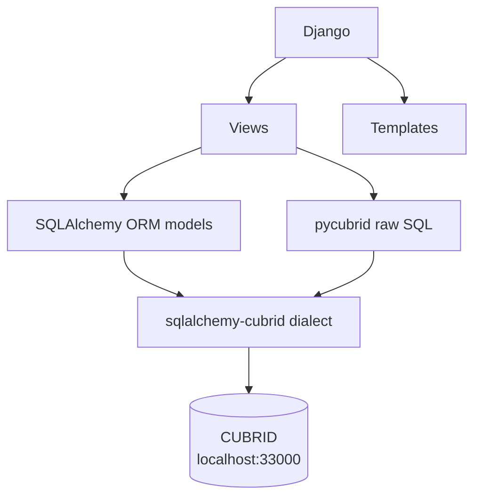
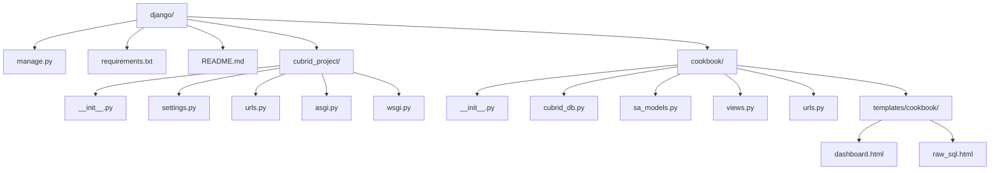

# Django + CUBRID Cookbook (Hybrid Integration)

Django does not have a native CUBRID backend. This example shows two integration patterns:

1. **Pattern 1**: Raw SQL via `pycubrid` in a Django view
2. **Pattern 2**: SQLAlchemy ORM used alongside Django for CUBRID tables

Django still uses SQLite for its own framework tables (`auth`, `admin`, `sessions`, etc.).
Application data for this example is stored in CUBRID using SQLAlchemy and pycubrid.

## Architecture



## Project Structure



## CUBRID Connection

- SQLAlchemy URL: `cubrid+pycubrid://dba@localhost:33000/testdb`
- pycubrid connect call:

```python
pycubrid.connect(host="localhost", port=33000, database="testdb", user="dba")
```

`pycubrid` uses `qmark` parameter style (`?`) for raw SQL placeholders.

## Code Highlights

### SQLAlchemy ORM Pattern (views.py)

```python
from sqlalchemy import select
from .cubrid_db import session_scope
from .sa_models import Employee

def dashboard(request):
    with session_scope() as session:
        statement = select(Employee).order_by(Employee.id)
        employees = list(session.scalars(statement).all())
    return render(request, "cookbook/dashboard.html", {"employees": employees})
```

### Raw SQL Pattern (views.py)

```python
from .cubrid_db import pycubrid_cursor

def raw_sql_examples(request):
    with pycubrid_cursor() as cursor:
        cursor.execute("SELECT COUNT(*) FROM cookbook_employee")
        total = cursor.fetchone()[0]

        cursor.execute(
            "SELECT name, salary FROM cookbook_employee WHERE salary >= ?",
            (str(min_salary),),
        )
        high_earners = cursor.fetchall()
    return render(request, "cookbook/raw_sql.html", {"summary": summary})
```

## Setup

1. Install dependencies:

   ```bash
   pip install -r requirements.txt
   ```

2. Optional environment overrides:

   - `CUBRID_SQLALCHEMY_URL`
   - `CUBRID_HOST`
   - `CUBRID_PORT`
   - `CUBRID_DB`
   - `CUBRID_USER`
   - `CUBRID_PASSWORD`

3. Run Django migrations for SQLite-backed Django framework tables:

   ```bash
   python manage.py migrate
   ```

4. Start the app:

   ```bash
   python manage.py runserver
   ```

## Quick Start with Docker

```bash
cd /data/GitHub/cubrid-cookbook/python/django
docker compose up --build
```

This runs CUBRID and Django together for local testing.

## Routes

| URL | View | Pattern |
|-----|------|---------|
| `/` | Dashboard | SQLAlchemy ORM — list employees, add new |
| `/raw-sql/` | Raw SQL | pycubrid — aggregate queries with `?` params |

## Expected Behavior

**Dashboard (`/`)**:
- Displays a table of employees from CUBRID `cookbook_employee`
- Provides a form to add new employees (name, department, salary, hire date)
- Uses SQLAlchemy Session for all data operations

**Raw SQL (`/raw-sql/`)**:
- Shows employee count, average salary, department breakdown
- Accepts `?min_salary=` query parameter to filter high earners
- Demonstrates `qmark` parameterized queries for safe SQL execution

## Why This Hybrid Approach

- Django ORM cannot target CUBRID directly because no official Django CUBRID backend exists.
- SQLAlchemy + `sqlalchemy-cubrid` provides robust CUBRID dialect support.
- Django still provides routing, templating, and request handling.
- Both patterns (SQLAlchemy ORM + pycubrid raw SQL) are production-viable.

## Troubleshooting

| Issue | Solution |
|-------|----------|
| `OperationalError: connect failed` | Ensure CUBRID is running: `make up` from repo root |
| Django migration errors | These only affect SQLite tables — CUBRID tables are managed by SQLAlchemy |
| Template not found | Run from the `django/` directory: `python manage.py runserver` |
| `?` params not binding | Pass params as a tuple: `cursor.execute(sql, (value,))` |

## Error Handling

For focused database error recipes (connection failures, constraint violations, lock/query timeouts), see:

- `/data/GitHub/cubrid-cookbook/python/error-handling/`
