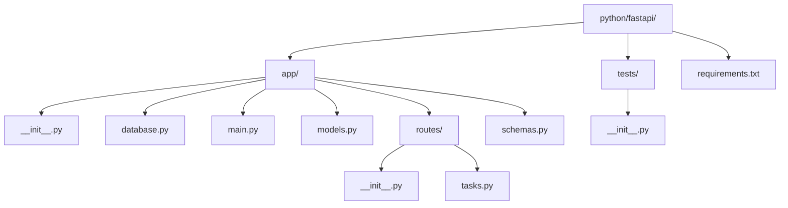

# FastAPI + CUBRID Cookbook Example

Production-ready FastAPI REST API example using SQLAlchemy ORM and the CUBRID dialect.

## Features

- FastAPI application with CORS middleware, lifespan startup/shutdown, and error handlers
- SQLAlchemy 2.0 ORM models and session dependency injection
- CUBRID connection URL: `cubrid+pycubrid://dba@localhost:33000/testdb`
- CRUD API for tasks (`cookbook_tasks` table)
- Pagination (`skip`, `limit`) and filtering (`completed`, `priority`) on list endpoint
- OpenAPI docs at `/docs` and `/redoc`

## Project Structure



## Prerequisites

- Python 3.10+
- CUBRID running on `localhost:33000`
- Database `testdb` exists and user `dba` is available

The root project Docker Compose already provides CUBRID. Start it from the repository root if needed.

## Quick Start with Docker

```bash
cd /data/GitHub/cubrid-cookbook/python/fastapi
docker compose up --build
```

This runs CUBRID and FastAPI together for local testing.

## Setup

```bash
cd /data/GitHub/cubrid-cookbook/python/fastapi
python -m venv .venv
source .venv/bin/activate
pip install -r requirements.txt
```

## Run

```bash
uvicorn app.main:app --reload
```

API base URL: `http://127.0.0.1:8000`

## API Endpoints

- `GET /tasks` - list tasks (supports pagination and filtering)
- `GET /tasks/{task_id}` - get one task
- `POST /tasks` - create task
- `PUT /tasks/{task_id}` - update task
- `DELETE /tasks/{task_id}` - delete task

## curl Examples

### 1) List tasks

```bash
curl -X GET "http://127.0.0.1:8000/tasks?skip=0&limit=20"
```

### 2) List tasks with filters

```bash
curl -X GET "http://127.0.0.1:8000/tasks?completed=false&priority=3&skip=0&limit=10"
```

### 3) Get task by ID

```bash
curl -X GET "http://127.0.0.1:8000/tasks/1"
```

### 4) Create task

```bash
curl -X POST "http://127.0.0.1:8000/tasks" \
  -H "Content-Type: application/json" \
  -d '{
    "title": "Write FastAPI cookbook",
    "description": "Create a complete FastAPI + CUBRID example",
    "completed": false,
    "priority": 2
  }'
```

### 5) Update task

```bash
curl -X PUT "http://127.0.0.1:8000/tasks/1" \
  -H "Content-Type: application/json" \
  -d '{
    "title": "Write and review cookbook",
    "completed": true,
    "priority": 1
  }'
```

### 6) Delete task

```bash
curl -X DELETE "http://127.0.0.1:8000/tasks/1"
```

## Response Notes

- `POST /tasks` returns `201 Created`
- `DELETE /tasks/{task_id}` returns `204 No Content`
- Not found resources return `404`
- Validation errors return `422`

## Interactive Docs

- Swagger UI: `http://127.0.0.1:8000/docs`
- ReDoc: `http://127.0.0.1:8000/redoc`

## Error Handling

For focused database error recipes (connection failures, constraint violations, lock/query timeouts), see:

- `/data/GitHub/cubrid-cookbook/python/error-handling/`
