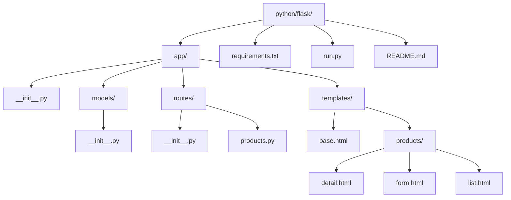

# Flask + Flask-SQLAlchemy CUBRID Example

Complete, runnable Flask project that demonstrates Product CRUD with CUBRID using:

- Flask app factory pattern
- Flask-SQLAlchemy with SQLAlchemy 2.0 typed models (`Mapped`, `mapped_column`)
- HTML pages (Bootstrap 5) + JSON API routes

## Requirements

- Python 3.10+
- CUBRID running on `localhost:33000`
- Database `testdb` available

Default database URL used by this app:

`cubrid+pycubrid://dba@localhost:33000/testdb`

## Quick Start with Docker

```bash
cd /data/GitHub/cubrid-cookbook/python/flask
docker compose up --build
```

This runs CUBRID and Flask together for local testing.

## Setup

```bash
cd /data/GitHub/cubrid-cookbook/python/flask
python -m venv .venv
source .venv/bin/activate
pip install -r requirements.txt
python run.py
```

Open: <http://localhost:5000/products>

Notes:

- Tables are created automatically at startup.
- You can also run `flask --app run.py init-db`.

## Project Structure



## Routes

| Method | Path | Type | Description |
|---|---|---|---|
| GET | `/products` | HTML | Product list page |
| GET | `/products/new` | HTML | Create form |
| POST | `/products` | HTML | Create product |
| GET | `/products/<id>` | HTML | Product detail page |
| GET | `/products/<id>/edit` | HTML | Edit form |
| POST | `/products/<id>/update` | HTML | Update product |
| POST | `/products/<id>/delete` | HTML | Delete product |
| GET | `/api/products` | JSON API | List products |
| GET | `/api/products/<id>` | JSON API | Product detail |
| POST | `/api/products` | JSON API | Create product |
| PUT | `/api/products/<id>` | JSON API | Update product |
| DELETE | `/api/products/<id>` | JSON API | Delete product |

## Example API Requests

Create product:

```bash
curl -X POST http://localhost:5000/api/products \
  -H "Content-Type: application/json" \
  -d '{
    "name": "Mechanical Keyboard",
    "description": "87-key TKL layout",
    "price": "129.99",
    "category": "Peripherals",
    "in_stock": 1
  }'
```

Update product:

```bash
curl -X PUT http://localhost:5000/api/products/1 \
  -H "Content-Type: application/json" \
  -d '{"price": "119.99", "in_stock": 0}'
```

Delete product:

```bash
curl -X DELETE http://localhost:5000/api/products/1
```

## Screenshots (Description)

- **Products list**: responsive table with category, price, stock badge, and action buttons.
- **Product detail**: card layout with metadata and description.
- **Create/Edit form**: single Bootstrap form for both modes, with validation feedback through flash messages.

## Error Handling

For focused database error recipes (connection failures, constraint violations, lock/query timeouts), see:

- `/data/GitHub/cubrid-cookbook/python/error-handling/`
